# Calibration procedure — OVGU AMS conveyor rig

Step by step, in the order the work actually happens. For *why* any of it is
built this way see [README.md](README.md); for reference on individual controls
see [USER_MANUAL.md](USER_MANUAL.md); for checking the result afterwards see
[VALIDATION_PLAN.md](VALIDATION_PLAN.md).

> **Every screenshot below is the synthetic rehearsal source, not the rig.**
> The tool ships with a virtual camera whose lens parameters are known, so the
> workflow can be walked end to end — and *verified* — with no hardware. That is
> what these images show. **No real camera on this rig has been calibrated yet.**
> The screenshots are here to show you what each control does and what a good
> result looks like, not to stand in for real data.

---

## 0. The state of play today

Before planning a session, three facts about this machine and this repository.

**One calibration file exists, and it is a rehearsal artefact.**

```
results/basler_1.json     source: "synthetic"     1280x720
```

It was produced by the virtual camera. It must be deleted before real work
(§3.4). This matters more than it sounds: the synthetic source renders at
1280×720, exactly what the rig records at, so the tool's resolution guard cannot
catch it. The rig page reloads saved intrinsics automatically, so without
intervention a real camera's pose would be solved against a virtual lens, and
every number downstream would be wrong with nothing looking unusual.

There is now a guard for precisely this — a `SYNTHETIC` flag on the status board
and a hard refusal to solve — but the file should still go.

**Two of the three camera SDKs are not installed here.**

| source | status | consequence |
|---|---|---|
| `pypylon` (Basler) | **not installed** | the app cannot open `basler_1` / `basler_2` directly |
| `pyrealsense2` (RealSense) | **not installed** | no live D435, and no factory-intrinsics cross-check |
| Aravis / `gi` (Lucid) | present | live Lucid possible, camera permitting |
| synthetic, folder | always available | — |

**Footage already exists.** `real_polybags/experiments/**` holds real recordings
of all five streams at 1280×720 — `basler_1`, `basler_2`, `lucid`,
`rgbd_1_color`, `rgbd_2_color`.

Those three facts together determine the route.

---

## 1. Choosing a capture route

The calibration does not care how the frames arrive. It cares that they show the
board and come from the camera at the resolution you record at.

| | what you get | needs | verdict |
|---|---|---|---|
| **A · Live in the app** | intrinsics + extrinsics | `pypylon` / `pyrealsense2` installed, cameras connected, rig time for everything | blocked today for Basler and RealSense |
| **B · Record → extract → Folder source** | intrinsics + extrinsics | the existing recorder (already works), rig time only for the board | **recommended** |
| **C · RealSense factory intrinsics** | intrinsics for the D435 only | `pyrealsense2`, camera connected | do it when the SDK is installed — it is the only independent check on the method |
| **D · Tape-measure homography** | a `provisional` plane mapping, no intrinsics | one frame of existing footage + a tape measure | fallback with no rig and no board; lens distortion stays uncorrected |

### Why Route B

`real_data/utils/record_all_5_cameras_macos.py` already talks to every camera —
it produced all the existing footage. So rather than installing SDKs into the
calibration app, record the board with the tool that already works, then extract
the usable frames and point the app's **Folder** source at them.

It also produces a better artefact. A recording is permanent: a calibration made
from it can be re-run, re-checked and argued with months later. A live session
exists only as its own result.

**Route B is verified end to end.** Rendering a board video from the synthetic
camera, extracting frames, and calibrating from the folder recovered the known
focal length to **0.16%** (`fx` 1101.8 vs 1100.0 true) with principal point
within 5 px, RMS 0.277 px. The route loses nothing against live capture.

---

## 2. What to prepare

Print both boards from [`boards/`](boards/):

| file | paper | for |
|---|---|---|
| `charuco_AMS-small_A4.pdf` | A4 | `basler_1` — an extreme close-up; the large board will not fit in frame |
| `charuco_AMS-large_A3.pdf` | A3 | `basler_2`, `lucid`, both RealSense — they see the whole belt width |

- **Print at 100% / "actual size".** Not "fit to page", not "shrink to fit".
- **Measure the printed 100 mm bar with a ruler.** If it is not exactly 100 mm,
  reprint. A board scaled by 3% produces a calibration that passes every internal
  check while every millimetre it reports is 3% wrong.
- **Matte paper**, mounted on foamboard or stiff card. A bowed sheet is a
  systematic error no amount of averaging removes.
- Keep the footer — it carries the board spec.

Also bring: a tape measure, and the belt's real width and length.

Finally, settle the camera list. **Names must match the recorder's stream
names** — `basler_1`, `basler_2`, `lucid`, `rgbd_1_color`, `rgbd_2_color` — because
a calibration is joined to detections by name. One saved under a name nothing
else uses is invisible downstream, and nothing reports that; it simply never
matches.

---

## 3. Phase 0 — rehearse with no hardware (~30 min)

Do this once, at your desk, before booking rig time. It is not a demo: the
synthetic camera's true `K` is known, so the tool reports your recovered values
*against the truth*. Ten minutes here means arriving at the lab knowing the
software works instead of debugging a web app next to a running conveyor.

```bash
conda activate ams
cd /Users/awthura/OVGU/AMS/real_polybags/calibration
python3 app.py                    # -> http://127.0.0.1:5000
```

### 3.1 Start a session

Camera `basler_1`, source **Synthetic camera**, board **AMS-small**, then
**Start session**.

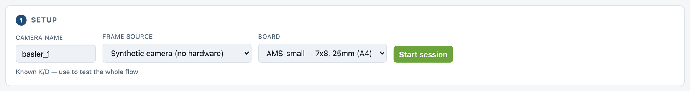

### 3.2 Capture

Press **Capture shot** (or `Space`) as the virtual board drifts. The coverage
grid on the right is the live quality signal — each cell is a region of the
frame the board has reached.

After 7 shots the sample is still thin:

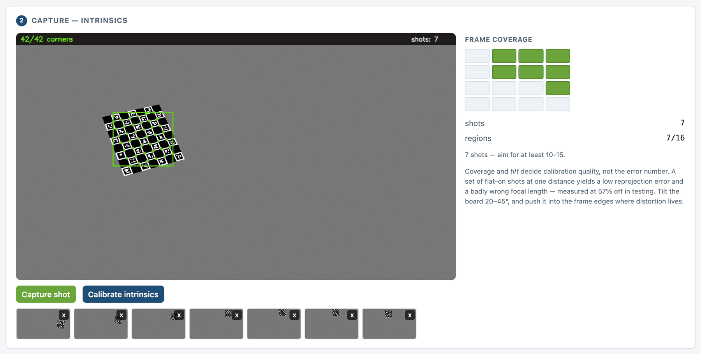

Keep going to 15–25 with the board reaching the **edges and corners**, where
lens distortion lives:

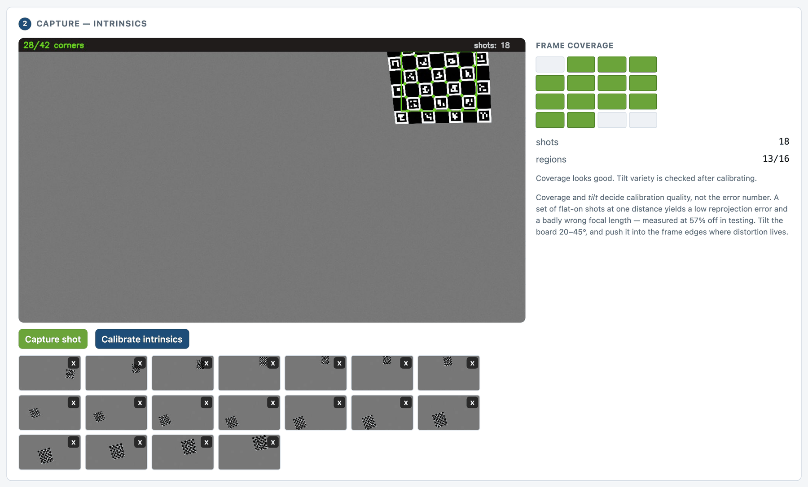

> Coverage and **tilt** decide calibration quality, not the error number. A set
> of flat-on shots at one distance yields a low reprojection error and a focal
> length measured 57% wrong in testing.

### 3.3 Calibrate and read the comparison

**Calibrate intrinsics.** Because the source knows its own truth, the panel
reports recovered vs true directly — the only way to tell a correct calibration
from a merely plausible one.

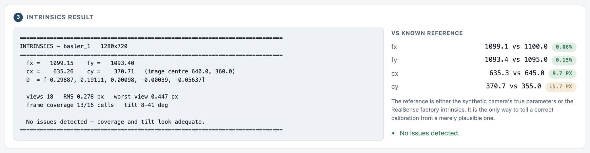

Expect focal length within ~0.5% and principal point within a few pixels. Then
walk the rig page (§5) with the same synthetic source so the controls are
familiar.

### 3.4 Delete the rehearsal results — do not skip

```bash
rm -f results/*.json          # removes the synthetic basler_1.json too
```

Rehearsal results are indistinguishable from real ones at a glance, and the app
reloads them automatically. The status board marks them `SYNTHETIC` and the tool
refuses to solve a real pose against them, but the clean move is to delete them.

---

## 4. Phase 1 — intrinsics, per camera (no rig access needed)

Intrinsics describe the **lens**, not the mounting. They can be measured at a
desk, at any time, as long as the lens, focus and **resolution** are the ones you
will record with and are not touched afterwards.

Do all cameras here before booking rig time.

### 4.1 Record the board

One recording per camera: hold the board in front of *that* camera and move it
around. The recorder writes all streams at once; you simply use the one you care
about.

```bash
cd /Users/awthura/OVGU/AMS/real_polybags/real_data/utils
python3 record_all_5_cameras_macos.py --duration 90 --fps 15 \
        --width 1280 --height 720
```

**The resolution must be the one you record experiments at.** Intrinsics are
resolution-specific: the Basler a2A1920 has a 1920×1200 sensor while this rig
records 1280×720, so the camera is cropping or scaling, and a `K` measured at one
resolution does not transfer to the other.

While recording, for ~90 s:

- **Tilt the board** 20–45° away from square-on, in varied directions. Tilt is
  what separates focal length from distance; without it they are ambiguous and
  `fx` is unreliable. Squareness is the failure mode here, not the goal.
- **Reach every part of the frame**, corners included.
- **Vary the distance** — near, mid, far.
- **Move slowly.** Motion blur moves corners, and a blurred board is still
  confidently detected, which is worse than not being detected at all.

### 4.2 Extract the usable frames

```bash
cd ../../calibration
python3 extract_board_frames.py \
        /path/to/basler_1_1280x720_<timestamp>.avi \
        --out frames/basler_1 --board small --max 20
```

This keeps only frames where the board is detected with enough corners and
enough sharpness, then selects for **pose variety** rather than taking every Nth
frame. Video is highly redundant — at 15 fps a slowly moved board gives hundreds
of near-identical views, and twenty of those constrain the lens no better than
one while looking like a healthy sample.

It prints the frame-coverage grid so you know whether the recording was good
*before* calibrating:

```
  usable      150
  wrote       20 frames -> frames/basler_1
  coverage    16/16 regions of the frame
              # # # #
              # # # #
              # # # #
              # # # #
```

Fewer than 12 of 16 regions, or fewer than 10 frames, and it warns. **Re-record
rather than proceeding** — it is far cheaper than discovering it later.

Use `--board large` for `basler_2`, `lucid` and the RealSense streams.

### 4.3 Calibrate and save

In the app: camera name (exactly the stream name), source **Folder of images**,
folder `frames/basler_1`, matching board, **Start session**.

A **Capture all frames** button appears for folder sources. Use it rather than
clicking *Capture shot* repeatedly: the preview cycles a folder at 15 fps, so a
20-image set goes past in 1.3 seconds and hand-clicking would sample it at random
and take some views twice. A duplicated view is weighted twice in the fit — the
same degeneracy as twenty frontal shots, arriving disguised as a bigger sample.
**Capture all frames** ingests each image exactly once and reports any it could
not detect a board in.

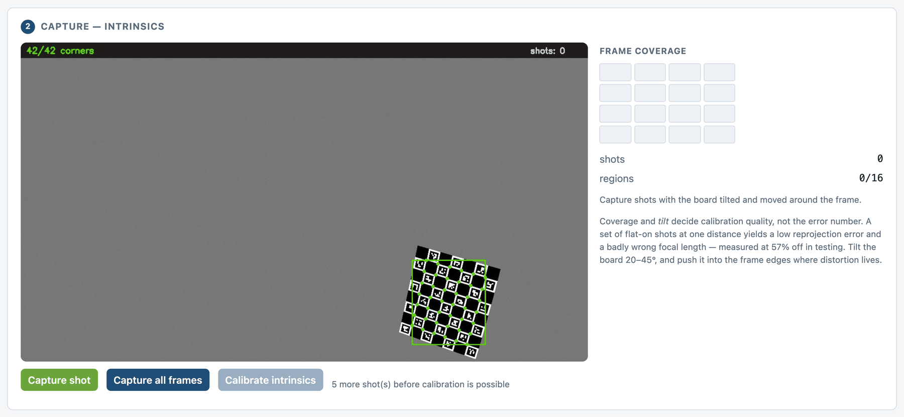

After ingesting, the coverage grid reflects the whole extracted set at once:

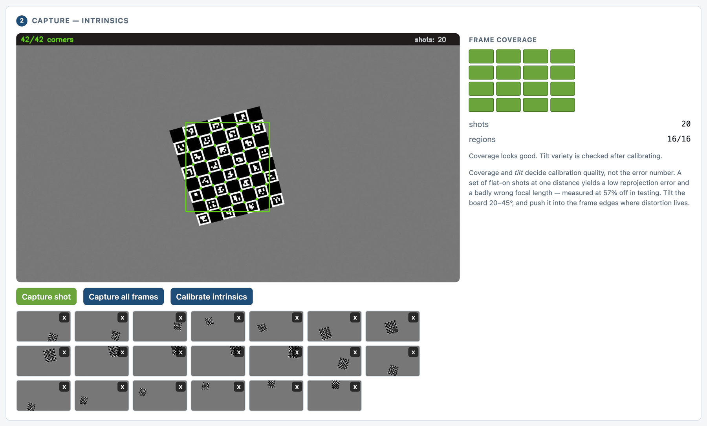

Then **Calibrate intrinsics**.

**Accept only if all of these hold:**

| | |
|---|---|
| RMS | under ~0.5 px |
| coverage | ≥ 12 of 16 regions |
| tilt | several views over 15° — the panel reports this |
| warnings | none, or understood and accepted |
| `fx` sanity | ≈ `f_mm / pixel_size_mm` from the lens marking and sensor spec |

That last one matters because it is the only check here independent of the fit.
A degenerate pose set can produce a low RMS beside a badly wrong `K`; the lens
marking will catch it.

Write notes that would let you reproduce this — lens, focal length, aperture,
whether focus was locked — and **Save calibration**.

Repeat for all five streams.

---

## 5. Phase 2 — extrinsics, all cameras in one sitting (rig required)

Extrinsics describe **where the camera is**. They need the rig in its final
state, and any bump to a mount voids them. This is why they are a separate page
and a separate sitting.

Open **http://127.0.0.1:5000/extrinsics**.

### 5.1 Fill in the anticipated measurements — before the session

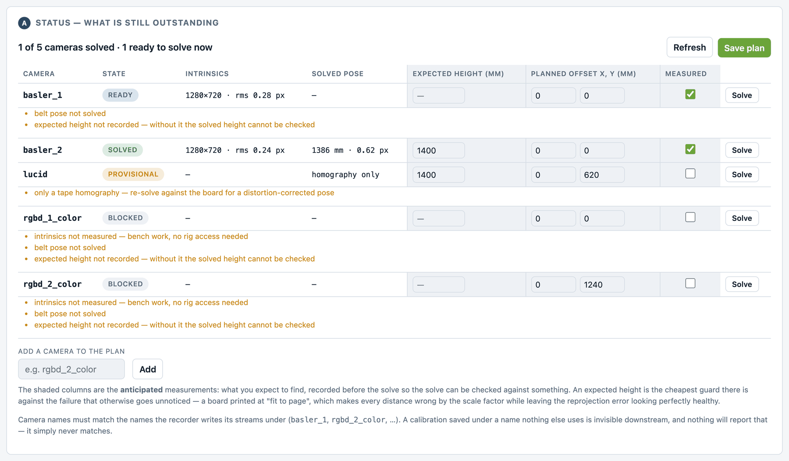

The table is rebuilt from `results/*.json` every time you open or refresh it.
Each camera reads:

| state | meaning |
|---|---|
| `blocked` | no intrinsics — Phase 1 first, no rig needed |
| `ready` | intrinsics in hand, no pose — **this is the rig work** |
| `provisional` | tape homography only; no lens correction |
| `solved` | done |

Anything outstanding is spelled out under each row.

The **shaded columns are inputs, not results** — the anticipated measurements:

- **Expected height (mm)** — roughly how far above the belt the camera is
  mounted. A tape to the lens is plenty accurate.
- **Planned offset X, Y (mm)** — where you intend to place the board for this
  camera, relative to the origin placement. X across the belt, Y along travel.
- **Measured** — tick it once the offset is an actual measurement rather than an
  intention.

**Save plan** persists them to `results/_plan/rig_plan.json`. Fill them in at
your desk days ahead; they survive restarts.

Note in the screenshot that `basler_1` carries a red `SYNTHETIC` flag — that is
a rehearsal result that has not been cleared. On a real run no camera should
show it.

### 5.2 Set the origin method

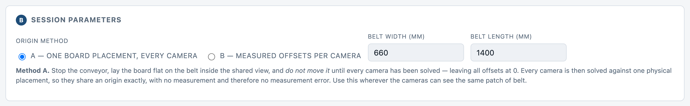

**Method A — one board placement, every camera.** Preferred wherever cameras can
see the same patch of belt. Every camera is solved against one physical
placement, so they share an origin *exactly*: no measurement, therefore no
measurement error.

```
1. STOP THE CONVEYOR.
2. Lay the board flat on the belt, inside the shared view.
3. DO NOT MOVE IT until every camera has been solved.
4. Leave every offset at 0.
```

**Method B — measured offsets.** For cameras looking at different stretches.

```
1. Solve the first camera at offset 0, 0 — this DEFINES the belt origin.
2. Move the board into the next camera's view.
3. Measure the displacement from the original position
     (X across the belt, Y along travel).
4. Enter it, tick Measured, then solve.
```

Accuracy here is your tape measure's accuracy, and it propagates directly into
cross-camera agreement. Prefer A; keep moves square to the belt so X and Y stay
meaningful.

Also enter the belt's real width and length — the belt map picks them up.

### 5.3 Five things that will bite you

1. **Stop the belt.** The board rests on it. Less obviously, Method A depends on
   every camera seeing the *same* placement, which a moving board makes
   impossible.
2. **Do not nudge the board between cameras.** In Method A that is the entire
   basis of the shared frame.
3. **The belt is not a perfect plane.** It sags between rollers. Place the board
   where bags actually travel, not at an unsupported span, so Z = 0 means the
   surface bags really sit on.
4. **Mount and aim everything first.** Re-aiming a camera voids its extrinsics.
   Intrinsics survive it.
5. **Resolution must match.** If reloaded intrinsics were measured at a
   different resolution than the camera now delivers, the tool refuses to solve
   rather than producing a plausible pose wrong by the scale ratio.

### 5.4 Solve each camera

Pick a camera the board reports as `ready`, choose the source, **Start session**.
Its saved intrinsics reload automatically and the offset prefills from the plan.

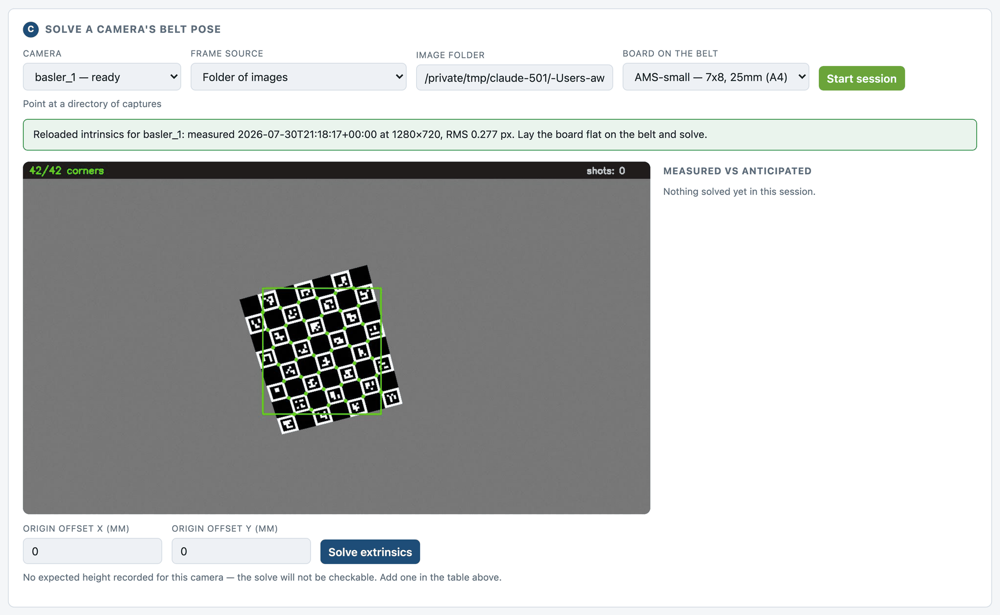

With the board flat on the belt and visible, press **Solve extrinsics**.

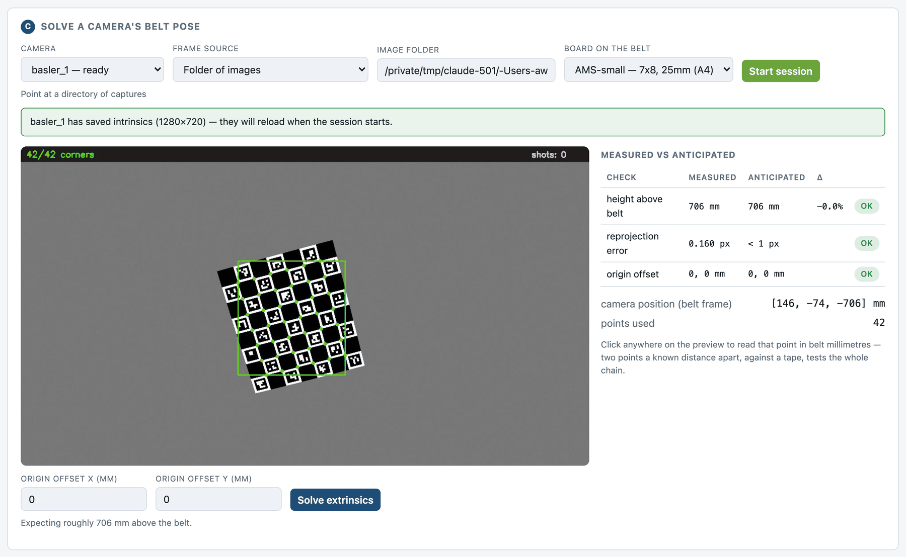

### 5.5 Read the check, not the number

Every solve is reported as **measured against anticipated**:

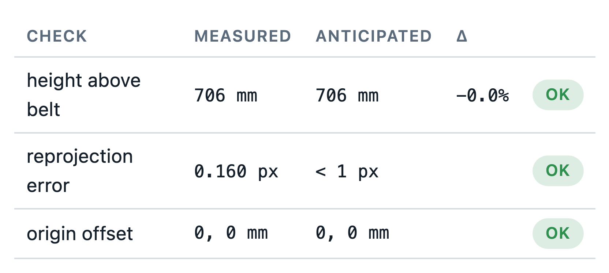

A camera with no expected height recorded reports `no ref` rather than passing —
an unmade comparison must not look like a successful one.

Here is what the check exists to catch:

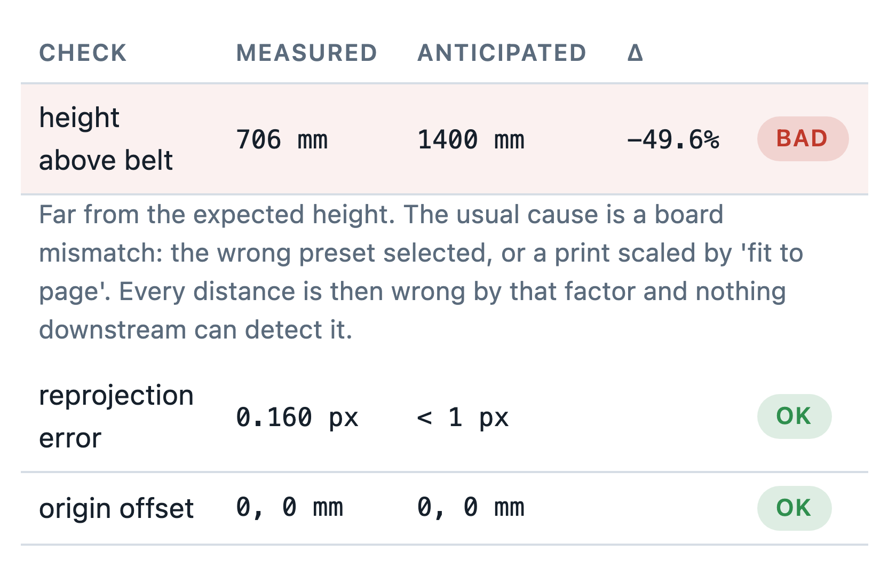

Note what is happening in that image. **The reprojection error is 0.476 px and
passes.** By every internal measure the calibration is healthy. Only the
comparison against an independently known height reveals that the geometry is
18% wrong. That signature — good RMS, wrong scale — is a board mismatch: wrong
preset selected, or a print scaled by "fit to page". Nothing downstream can
detect it.

### 5.6 Validate before moving on

While the board is still there, per camera:

- **Click two points** on the preview a known distance apart and compare the
  belt millimetres against a tape. The height check the page already did for
  you; this one tests the *mapping*, and nothing can substitute for it.

Then **Save**, and pick the next camera — under Method A, without touching the
board.

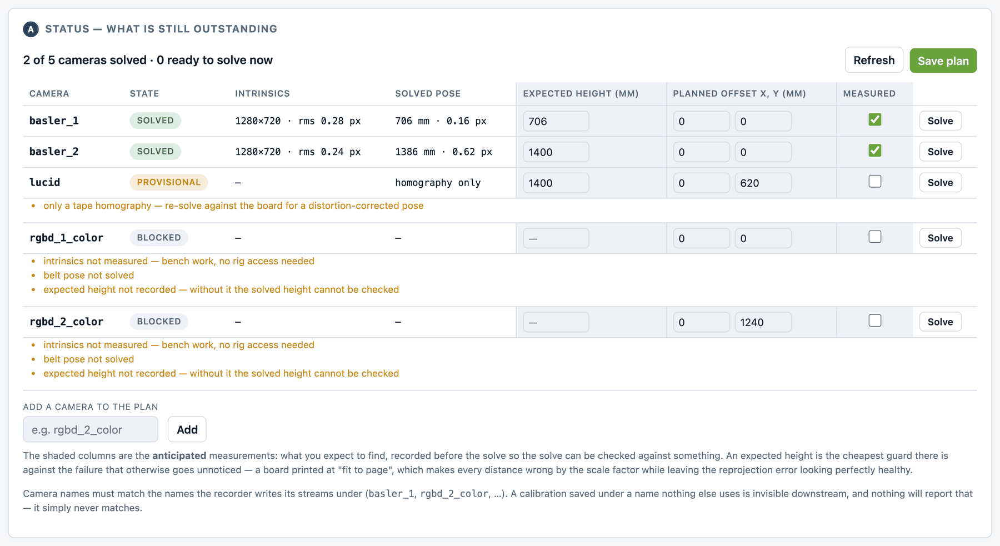

### 5.7 The strongest check — do not leave the rig without it

Once two or more cameras are solved: **move the board to a new position** in view
of both, and click the *same physical corner* in each. Both must report the same
belt coordinates.

This is genuine held-out validation — the extrinsics came from a *different*
placement, so nothing about this measurement was used in the fit. It directly
measures the one claim the whole calibration exists to support: that a bag at
(X, Y) mm is the same bag whichever camera saw it.

Repeat at 3–4 positions spread along and across the belt. Error is not uniform,
and a single central test hides edge behaviour — which is exactly where it is
worst. **Write the numbers down.** Nothing records them yet
([VALIDATION_PLAN.md](VALIDATION_PLAN.md) §7 item 2).

---

## 6. Phase 3 — the belt map

Back on the intrinsics page, step 5. Enter the belt's real dimensions and
**Build belt map**. It is assembled from every saved calibration, so it grows as
cameras are added.

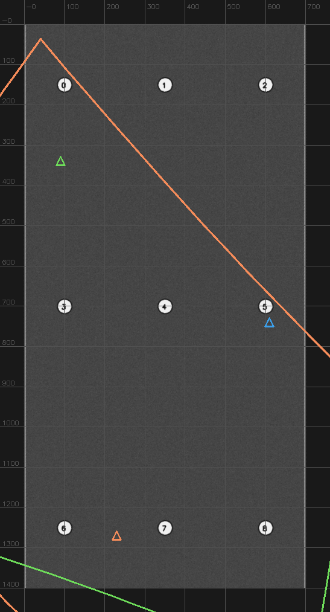

*(From `verify_beltmap.py`'s three-camera synthetic rig — a real one will look
different. Grid lines are 100 mm; triangles are camera positions; coloured
polygons are per-camera footprints.)*

You get each camera's rectified view composited top-down, its footprint in
millimetres, and **measured pairwise overlap** — which finally answers whether
these cameras share a view. Nothing in the design assumes they do.

> Enter real belt dimensions rather than guessing. The automatic extent sizes the
> canvas to everything the cameras see — floor and machinery included — and
> measured 3055 × 4199 mm for a 700 × 1400 mm belt in testing.

Check that footprints sit where those cameras actually look. One in the wrong
place means a wrong origin offset.

**One honest limitation.** The map assumes everything lies on Z = 0. A bag has
height, so its top projects outward from the camera's nadir — 10–45 mm for a
60 mm bag, depending on distance. That is a *systematic bias*, not noise: it does
not average away and it grows toward the frame edges.
`beltmap.parallax_error_mm()` quantifies it.

---

## 7. Phase 4 — validation

The checks above are the ones that must happen while you are at the rig. The
full plan — what else to measure, what to build, and what none of it can catch —
is [VALIDATION_PLAN.md](VALIDATION_PLAN.md).

The minimum worth doing:

1. **Held-out board positions** (§5.7) — 15 min at the rig.
2. **Straight-line and constant-speed check** on an existing recording — no rig
   needed. In belt coordinates a conveyor moves objects in a straight line at
   constant speed, so lateral deviation and speed variation are direct read-outs
   of mapping error across the *whole* field of view, not just at clicked points.
3. **Write both results down** so the next person can tell a validated
   calibration from an unvalidated one.

Not yet built; item 1 in the plan's build order.

---

## 8. When to redo what

| what changed | intrinsics | extrinsics |
|---|---|---|
| camera re-aimed or mount bumped | keep | **redo** |
| lens changed, refocused, aperture changed | **redo** | **redo** |
| recording resolution changed | **redo** | **redo** |
| belt moved, or origin redefined | keep | **redo** |
| board reprinted | keep | keep — but re-verify the 100 mm bar |
| nothing, 6 months elapsed | keep | re-validate (§7) |

Saving intrinsics never deletes a pose solved earlier — but if the intrinsics
changed, the pose is kept **flagged stale**, because it was solved against a
different `K`, and the status board lists it as outstanding until re-solved.

---

## 9. Done means

- [ ] `results/` contains one JSON per stream, named exactly as the recorder
      names it
- [ ] no camera on the status board shows `SYNTHETIC`, `blocked` or `provisional`
- [ ] every camera reads `solved`; the headline says `N of N cameras solved`
- [ ] every height check passed against a recorded expectation — no `no ref`
- [ ] every extrinsic reprojection error under ~1 px
- [ ] belt map built with real dimensions; footprints plausible; overlap figures
      recorded
- [ ] held-out board agreement measured at 3–4 positions and **written down**
- [ ] notes in each record sufficient to reproduce it

---

## Appendix A — commands

```bash
# rehearse, no hardware
python3 app.py                                    # -> :5000, synthetic source
python3 verify_synthetic.py --views 24            # expect PIPELINE VERIFIED
python3 verify_beltmap.py                         # expect BELT MAP VERIFIED

# clear rehearsal artefacts before real work
rm -f results/*.json

# record the board (all streams at once)
python3 ../real_data/utils/record_all_5_cameras_macos.py \
        --duration 90 --fps 15 --width 1280 --height 720

# extract usable, varied frames
python3 extract_board_frames.py VIDEO.avi --out frames/basler_1 \
        --board small --max 20

# calibrate: app.py -> Folder source -> frames/basler_1
# then the rig page for poses:            http://127.0.0.1:5000/extrinsics

# regenerate the printed boards
python3 core/board.py                             # both, 300 dpi
python3 core/board.py --preset large --dpi 600

# port 5000 is taken by macOS AirPlay
python3 app.py --port 5001
```

## Appendix B — where things live

```
calibration/
  PROCEDURE.md            this document
  README.md               design rationale and verification method
  USER_MANUAL.md          per-control reference
  VALIDATION_PLAN.md      how to check the result afterwards
  app.py                  the web server — run this
  extract_board_frames.py video -> calibration frames
  verify_synthetic.py     ground-truth check, no hardware
  verify_beltmap.py       multi-camera map check, no hardware
  boards/                 print-ready PDFs + specs
  core/                   board, intrinsics, extrinsics, beltmap, sources,
                          store, plan
  results/                per-camera calibration JSON
    _plan/rig_plan.json   session plan and anticipated measurements
  docs/screenshots/       the images in this document
```

Troubleshooting table: [USER_MANUAL.md §7](USER_MANUAL.md).
